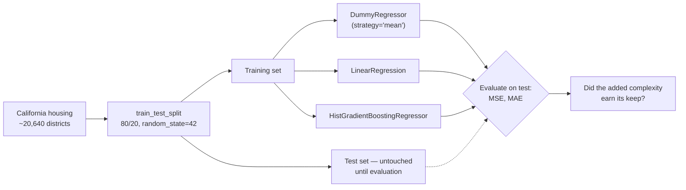
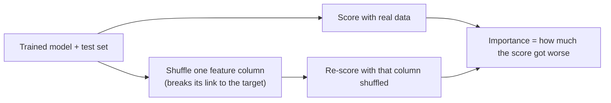
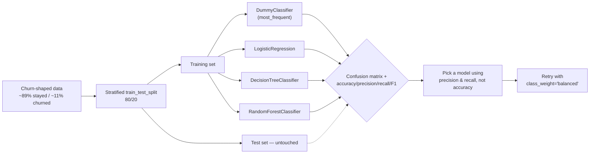
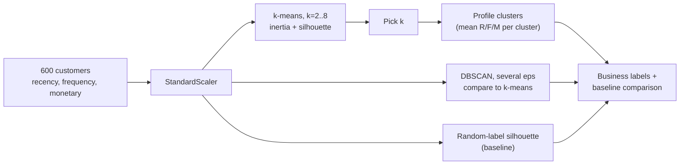

# Session 1.3. Practical: Regression, Classification, and Clustering (scikit-learn)

## Getting started

This is the first practical session of the course, so it's the only lesson
that spells out environment setup in full — later practicals (2.3, 3.3, 4.3)
just point back to their own `requirements.txt` and assume you already have
the habit from here. Do this once, before task 1.

### 1. Check your Python version

You need **Python 3.11 or newer**. Check what you have:

```bash
python3 --version   # macOS/Linux
py --version         # Windows
```

If that's missing or too old, install a current release from
[python.org/downloads](https://www.python.org/downloads/) (Windows: tick
"Add python.exe to PATH" in the installer) — always check the site for the
current release rather than trusting a version number written here.

### 2. Create and activate a virtual environment

A virtual environment (`venv`) keeps this course's packages separate from
anything else installed on your machine. Create one **inside the module
folder** (`modules/01-classical-ml/`), so every lesson in the module can
share it:

**macOS / Linux (bash/zsh):**

```bash
cd ml_basics
python3 -m venv .venv
source .venv/bin/activate
```

**Windows (PowerShell):**

```powershell
cd modules\01-classical-ml
py -m venv .venv
.venv\Scripts\Activate.ps1
```

If PowerShell refuses to run the activation script (`running scripts is
disabled on this system`), it's blocking *unsigned* scripts by default —
run this once in that PowerShell window and try activating again:

```powershell
Set-ExecutionPolicy -Scope Process -ExecutionPolicy Bypass
```

**Windows (Command Prompt / `cmd.exe`):**

```bat
cd modules\01-classical-ml
py -m venv .venv
.venv\Scripts\activate.bat
```

On any platform, activation worked if your prompt now starts with
`(.venv)`. You'll repeat just the *activate* command (not the `venv`
creation step) every time you come back to work on this course — the
environment persists on disk once created.

### 3. Install the packages

With the environment active:

```bash
pip install --upgrade pip
pip install -r requirements.txt
```

This installs scikit-learn, pandas, matplotlib, numpy, and JupyterLab — see
[`../requirements.txt`](../requirements.txt) for exact versions. The first
install can take a minute or two; later re-runs are fast since pip caches
downloaded packages.

### 4. Launch Jupyter and work through the lesson in a notebook

```bash
jupyter lab
```

This opens JupyterLab in your browser. Create a new Python notebook inside
this lesson's folder (e.g. `1.3-practical.ipynb`) and, as you read through
"Detailed lesson material" below, copy each code block into its own cell in
order and run it (Shift+Enter) before moving to the next — that's what lets
plots render inline and keeps every variable (`X_train`, `boosted`, `df`,
...) available to the next cell, exactly as the code below assumes. Working
notebook-first also matches task 4's and Part 3's plotting/profiling steps
far better than a plain terminal script would.

When you're done for the session, save the notebook, then either close the
browser tab and leave JupyterLab running or stop it with `Ctrl+C` in the
terminal; deactivate the virtual environment with `deactivate` if you're
switching to other work.

## Practical tasks

Work individually or in pairs. Use the code in "Detailed lesson material"
below as your reference — don't just copy it, run each step and check your
own numbers.

1. **Load, look, and split.** Load the California housing dataset
   (`fetch_california_housing(as_frame=True)`), print the first 5 and last 5
   rows to see what a district's row actually looks like, then split it into
   train and test sets (80/20, `random_state=42`). *Done when:* you've looked
   at both row samples and printed the shapes of `X_train`/`X_test`, and
   they're consistent with an 80/20 split of ~20,640 rows.
2. **Baseline vs. linear regression.** Fit a `DummyRegressor(strategy="mean")`
   and a `LinearRegression` on the training set. Compute MSE and MAE for
   both on the *test* set. *Done when:* you can state, in one sentence, the
   percentage improvement linear regression bought over the mean-prediction
   baseline — the exact habit from lesson 1.2, now as one line of
   code instead of a by-hand table.
3. **Add gradient boosting.** Fit a `HistGradientBoostingRegressor` on the
   same split, compute the same two metrics, and add it as a third row to
   your comparison table. *Done when:* you have a 3-row table (baseline /
   linear / boosting) and one sentence on whether the jump from linear to
   boosting earned its added complexity, using lesson 1.2's "did it earn
   its complexity" framing.
4. **Diagnose, don't just aggregate.** For your best model, plot predicted
   vs. actual price on the test set (a scatter plot with a diagonal
   reference line where prediction = actual), then print the 5 test rows
   with the largest absolute error. *Done when:* you can point at the
   feature values of those 5 worst predictions and offer a plausible reason
   the model struggled with them (not just "the error is high").
5. **Load and stratified split.** Generate the churn-shaped dataset (code
   below) and split it 80/20 with `stratify=y`. Print the class counts in
   the full dataset, the training set, and the test set. *Done when:* all
   three show essentially the same class proportions (~89% "stayed" / ~11%
   "churned") — confirming the stratified split preserved the imbalance
   instead of accidentally concentrating it in one side.
6. **Baseline vs. logistic regression.** Fit a
   `DummyClassifier(strategy="most_frequent")` and a `LogisticRegression`.
   For both, compute accuracy, precision, recall, F1, and the confusion
   matrix on the test set. *Done when:* you can state, using your own
   numbers, why the baseline's ~89% accuracy is worthless here, and why
   logistic regression barely beating that accuracy number is *also* not
   good news once you look at its recall.
7. **Compare tree-based models.** Add `DecisionTreeClassifier` and
   `RandomForestClassifier` to the same comparison table. *Done when:* you
   can name which model you'd pick and justify it using precision *and*
   recall together — check whether one model dominates the other on both,
   or whether it's a genuine tradeoff with no single right answer.
8. **Rebalance with `class_weight`.** Retrain your best model from task 7
   with `class_weight="balanced"` and compare its confusion matrix and
   metrics to the unweighted version. *Done when:* you can state, in one
   sentence, which metric improved, which one got worse, and whether that
   trade is the right one for a churn scenario where missing a customer who
   was about to leave usually costs more than one wasted retention offer to
   a happy customer.
9. **Build the customer dataset and scale it.** Generate the synthetic RFM
   dataset (code below: 600 customers, each with `recency_days`,
   `frequency`, and `monetary`), then standardize the three features with
   `StandardScaler`. *Done when:* you can show the pre-scaling summary
   statistics (the three columns live on wildly different numeric ranges)
   and explain, in one sentence, why an unscaled `monetary` column
   (hundreds to thousands) would dominate `frequency`'s (single digits) in
   a distance calculation.
10. **Choose k with elbow + silhouette, then profile.** Fit k-means for
    k=2 through 8 on the scaled data, record inertia and silhouette for
    each, and pick a k. Then compute the mean `recency_days`/`frequency`/
    `monetary` per cluster for your chosen k and write one short,
    descriptive, business-style label per cluster (e.g., "champions",
    "at risk"). *Done when:* you have both tables, plus a one-sentence
    justification for your chosen k that references the actual
    inertia/silhouette numbers, not just "I picked what looked right."
11. **Try DBSCAN and compare.** Run `DBSCAN(min_samples=10)` at
    `eps` = 0.3, 0.5, and 0.7 on the same scaled data, and record the
    cluster count and noise-point count for each. *Done when:* you can
    explain, using lesson 1.2's k-means-vs-DBSCAN comparison, why DBSCAN
    struggles to cleanly recover the same segments k-means found here.
12. **Baseline check.** Compute the silhouette score of a random label
    assignment (same number of groups as your chosen k) on this same
    scaled data, and compare it against your real clustering's silhouette
    score from task 10 — the exact technique from lesson 1.2. *Done when:*
    you can state the numeric gap between the two and what it proves about
    whether your segments reflect real structure.

## Detailed lesson material

### From a six-row table to real datasets

Lesson 1.2 taught MSE, MAE, and the baseline-first habit on a six-row
apartment-price table you could compute by hand. That was deliberate — it
let you see every number. Today you run the identical discipline three
times, on three real scikit-learn pipelines: a regression problem, an
imbalanced classification problem, and an unsupervised clustering problem —
each with a real dataset instead of a six-row table.

### Part 1 — Regression: forecasting California housing prices

You start with the **California housing dataset**, ~20,640 census
districts, each with a median house value to predict from eight numeric
features (median income, house age, average rooms/bedrooms per household,
population, average occupancy, and latitude/longitude).



#### Loading the data and splitting it

```python
from sklearn.datasets import fetch_california_housing
from sklearn.model_selection import train_test_split

data = fetch_california_housing(as_frame=True)
X, y = data.data, data.target  # y = median house value, in $100,000s

print(data.frame.head())   # first 5 districts
print(data.frame.tail())   # last 5 districts

X_train, X_test, y_train, y_test = train_test_split(
    X, y, test_size=0.2, random_state=42
)
print(X_train.shape, X_test.shape)  # (16512, 8) (4128, 8)
```

`data.frame` is the same rows as `X` with the target column
(`MedHouseVal`) attached, so printing its head/tail shows features and
target side by side. Look before you model: every column here is already a
district-level *aggregate* (an average or a median), not a single
household's data — `AveRooms` is average rooms per household in that
district, not room count for one house — which is worth knowing before you
try to interpret any coefficient or importance score later in this lesson.

`X_test`/`y_test` don't get touched again until final evaluation — same
discipline as lesson 1.1.

**A note on `random_state` (the "seed").** `train_test_split` here, and
several models later in this lesson (`HistGradientBoostingRegressor`,
`RandomForestClassifier`, `KMeans`), take a `random_state` argument. Each of
them makes a choice that's supposed to look random — which rows land in the
test set, which feature a tree split considers, where initial cluster
centers get placed — but ordinary code has no source of *true* randomness:
it uses a pseudo-random number generator (PRNG) that produces a long,
deterministic sequence of numbers starting from a number you give it, the
**seed**. `random_state=42` fixes that starting point, so the "random"
choice comes out identical every time the code runs, on any machine.

That matters because without a fixed seed, re-running the *exact same
code* would draw a different 80/20 split (or a different tree, or
different initial centroids) each time, so your MSE could shift between
two runs even though nothing you wrote changed — leaving no way to tell
whether a metric moved because of an edit you made or just a different
random draw. Fixing the seed removes that noise: it's what makes it
meaningful to compare your baseline MSE against the numbers quoted later
in this lesson at all. `42` has no special meaning — any fixed integer
works the same way — but this lesson uses it everywhere so every
intermediate result stays directly comparable, both across your own reruns
and against the numbers shown here.

#### A real baseline, in one line

Lesson 1.2 kept insisting on comparing against "always predict the
mean" before trusting any model's numbers. scikit-learn has a class for
exactly that, so there's no excuse to skip it:

```python
from sklearn.dummy import DummyRegressor
from sklearn.metrics import mean_squared_error, mean_absolute_error

baseline = DummyRegressor(strategy="mean")
baseline.fit(X_train, y_train)
pred_baseline = baseline.predict(X_test)

mse_baseline = mean_squared_error(y_test, pred_baseline)
mae_baseline = mean_absolute_error(y_test, pred_baseline)
```

`DummyRegressor(strategy="mean")` predicts the training set's mean target
value for every single test row, ignoring the features entirely — it is
the baseline-first principle as an actual, runnable model, not just an
idea you compute by hand.

#### Linear regression and gradient boosting, for real

```python
from sklearn.linear_model import LinearRegression
from sklearn.ensemble import HistGradientBoostingRegressor

linear = LinearRegression().fit(X_train, y_train)
pred_linear = linear.predict(X_test)
mse_linear = mean_squared_error(y_test, pred_linear)
mae_linear = mean_absolute_error(y_test, pred_linear)

boosted = HistGradientBoostingRegressor(random_state=42).fit(X_train, y_train)
pred_boosted = boosted.predict(X_test)
mse_boosted = mean_squared_error(y_test, pred_boosted)
mae_boosted = mean_absolute_error(y_test, pred_boosted)
```

`HistGradientBoostingRegressor` is scikit-learn's own histogram-based
gradient boosting implementation — the same core idea as XGBoost/LightGBM
from lesson 1.2 (sequential trees correcting residuals, histogram-based
split-finding for speed), shipped with scikit-learn itself so this
practical needs no extra install. Swapping in `xgboost.XGBRegressor` or
`lightgbm.LGBMRegressor` later is a one-line change — same
`fit`/`predict` shape, per lesson 1.2's external links.

Results on this exact split (scikit-learn 1.9; your numbers may shift in
the third decimal with a different library version, but the *pattern*
won't):

| Model | Test MSE | Test MAE |
|---|---|---|
| Baseline (`DummyRegressor`, mean) | 1.31 | 0.91 |
| Linear regression | 0.56 | 0.53 |
| Gradient boosting | 0.22 | 0.31 |

The pattern from lesson 1.2's ensemble task repeats here almost exactly:
the biggest jump is baseline → linear (a model that looks at the features
at all beats one that ignores them completely), and there's a further
large, genuine jump to gradient boosting — unlike the smaller
random-forest → boosting gap in lesson 1.2's numbers. That's not a
contradiction; it's a reminder that "how much complexity earns its keep" is
a question you answer by measuring on *your* data, not by memorizing a rule
of thumb from a different dataset.

#### Diagnosing errors beyond the aggregate metric

MSE and MAE are single numbers that hide *where* a model goes wrong. Two
quick diagnostics catch what the aggregate can't:

```python
import matplotlib.pyplot as plt
import pandas as pd

plt.scatter(y_test, pred_boosted, alpha=0.3, s=10)
lims = [y_test.min(), y_test.max()]
plt.plot(lims, lims, "r--")  # perfect-prediction reference line
plt.xlabel("Actual median house value")
plt.ylabel("Predicted median house value")
plt.show()

results = X_test.copy()
results["actual"] = y_test.values
results["predicted"] = pred_boosted
results["abs_error"] = (results["predicted"] - results["actual"]).abs()
print(results.sort_values("abs_error", ascending=False).head(5))
```

A predicted-vs-actual scatter reveals systematic patterns a single error
number cannot. Run the code above and look at your 5 worst rows: on this
exact split, 4 of the 5 largest errors share an actual value of almost
exactly 5.00001 ($500,001) — that's not a coincidence, it's this dataset's
known target-cap artifact (every district originally worth more than
$500,000 was recorded at that ceiling). The model, having learned an
average relationship from mostly-uncapped examples, has no way to know
that value is an artificial ceiling rather than a genuinely predictable
price, and consistently under-predicts every district that hit it — visible
as a flat band of under-predicted points in the scatter plot, too. Printing
the worst individual rows turned "the model is sometimes wrong" into a
specific, checkable hypothesis — exactly what practical task 4 asks you to
do, and a pattern no aggregate MSE/MAE number could have surfaced on its
own.

#### A second view: the residual plot

The predicted-vs-actual scatter answers "how close are we?" A **residual
plot** — the prediction error itself (`predicted - actual`) against the
predicted value — answers a different question: "is the model wrong in a
*consistent* way, or just noisily?"

```python
residuals = pred_boosted - y_test

plt.scatter(pred_boosted, residuals, alpha=0.3, s=10)
plt.axhline(0, color="r", linestyle="--")  # zero-error reference line
plt.xlabel("Predicted median house value")
plt.ylabel("Residual (predicted − actual)")
plt.show()
```

A model with no systematic blind spot scatters residuals randomly around
the zero line at every predicted value. Here, instead, the same capped
districts from the paragraph above trace out a clean **diagonal streak**
of negative residuals — because their actual value is pinned at the same
constant (≈5.00001) no matter what the model predicts, `residual =
predicted - 5.00001` is a straight line in this view — a dead giveaway
that these points share one exact cause, not scattered noise. That
one-sided, structured pattern is exactly what a purely aggregate number
like MSE can't distinguish from ordinary noise: MSE looks the same whether
errors are random or all pointing the same direction, but only one of
those is a bias worth fixing (e.g., by handling the capped rows
separately) rather than something you just have to live with.

#### What "baseline" actually looks like, next to the real models

Task 4's scatter plot works for one model at a time. Put all three side by
side and "the baseline is worthless" stops being a number you read off a
table and becomes something you can see directly:

```python
import matplotlib.pyplot as plt

fig, axes = plt.subplots(1, 3, figsize=(15, 5), sharex=True, sharey=True)
lims = [y_test.min(), y_test.max()]
for ax, name, pred in zip(
    axes,
    ["baseline (DummyRegressor)", "linear regression", "gradient boosting"],
    [pred_baseline, pred_linear, pred_boosted],
):
    ax.scatter(y_test, pred, alpha=0.3, s=8)
    ax.plot(lims, lims, "r--")
    ax.set_title(name)
    ax.set_xlabel("Actual")
axes[0].set_ylabel("Predicted")
plt.tight_layout()
plt.show()
```

Look at the three panels left to right. The baseline's cloud is a flat
horizontal band: `DummyRegressor(strategy="mean")` predicts the exact same
number — the training set's mean — for every district no matter what its
actual value is, and that flat band *is* what "a model that ignores the
features" looks like on a predicted-vs-actual plot. Linear regression tilts
into a diagonal-ish cloud but stays wide, with a lot of vertical scatter
around the red reference line. Gradient boosting hugs that diagonal far more
tightly, except in the same far-right target-cap column task 4 already
found. A single fitted line across all 8 features isn't something you can
draw, but this predicted-vs-actual view works regardless of feature count
and makes the size *and shape* of each step's improvement visible at a
glance — not just its MSE/MAE number.

You can make the same comparison numeric, as a bar chart, by rebuilding the
3-row table from task 3 as a `DataFrame`:

```python
import pandas as pd

comparison = pd.DataFrame(
    {"MSE": [mse_baseline, mse_linear, mse_boosted],
     "MAE": [mae_baseline, mae_linear, mae_boosted]},
    index=["baseline", "linear", "boosting"],
)
comparison.plot(kind="bar", figsize=(6, 4))
plt.ylabel("Error")
plt.title("MSE / MAE by model")
plt.xticks(rotation=0)
plt.tight_layout()
plt.show()
```

Both bars shrink at every step, with the biggest single drop from baseline
to linear — the same story as the scatter plots, in a second form.

#### Feature importance: permutation importance

Lesson 1.2 mentioned that random forests report feature importance for
free. Linear regression and gradient boosting need a method that works for
*either* model type: **permutation importance**. The idea: take a trained
model and the test set, shuffle one feature column so its values no longer
correspond to the right rows (destroying whatever relationship it had with
the target), and measure how much the model's test-set score gets worse.
A feature the model actually relies on will hurt performance a lot when
scrambled; an unused or redundant feature won't move the score much.



```python
from sklearn.inspection import permutation_importance

result = permutation_importance(
    boosted, X_test, y_test, n_repeats=10, random_state=42,
    scoring="neg_mean_squared_error"
)
importances = (
    pd.Series(result.importances_mean, index=X_test.columns)
    .sort_values(ascending=False)
)
print(importances)
```

Because `permutation_importance` only needs `predict`, it works identically
for `linear` and `boosted` — run it on both and compare which features each
model actually leans on; they don't have to agree. One real caveat worth
knowing before you trust the ranking: if two features are correlated (this
dataset's `AveRooms` and `AveBedrms` correlate at about 0.85), shuffling
just one of them barely hurts the score, because the model can still lean
on its correlated twin — permutation importance can under-report the true
importance of *either* feature in a correlated pair, splitting the credit
between them rather than crediting one.

Reading four numbers off a printed `Series` still takes a second of mental
sorting; a horizontal bar chart makes the ranking, and how close any two
bars are, visible immediately:

```python
importances.plot(kind="barh")
plt.xlabel("Mean decrease in score (neg. MSE) when shuffled")
plt.gca().invert_yaxis()  # largest importance on top
plt.tight_layout()
plt.show()
```

The gap between `Latitude`/`Longitude`/`MedInc` and everything else is
obvious at a glance, and so is the pair of short, similarly-sized bars for
`AveRooms`/`AveBedrms` — the visual signature of the split-credit problem
described above, worth checking for whenever two bars are close *and* you
know (or suspect) the underlying features are correlated.

### Part 2 — Classification: predicting customer churn under imbalance

Now switch tracks: this practical builds a customer-churn classifier — a
customer either stayed or churned (canceled), and, as in almost every real
churn dataset, most customers stay: only a minority actually leave. Rather
than depending on an external download, we simulate a dataset with exactly
that shape using scikit-learn's `make_classification`, so your numbers
below are reproducible byte-for-byte:

```python
from sklearn.datasets import make_classification
from sklearn.model_selection import train_test_split
import numpy as np

X, y = make_classification(
    n_samples=5000, n_features=12, n_informative=6, n_redundant=2,
    weights=[0.9, 0.1], class_sep=1.0, flip_y=0.02, random_state=42
)
print("overall:", np.bincount(y))  # [4463  537] — ~89% stayed, ~11% churned

X_train, X_test, y_train, y_test = train_test_split(
    X, y, test_size=0.2, stratify=y, random_state=42
)
print("train:", np.bincount(y_train))  # [3570  430]
print("test:", np.bincount(y_test))    # [893  107]
```

`stratify=y` is doing real work here, and it's the payoff of lesson 1.1's
stratification note: without it, an unlucky split could easily leave the
test set with a noticeably different churn rate than training, making
every metric below harder to trust. The feature columns here are
unlabeled synthetic numbers, not real customer attributes — the goal is
an honest imbalance to practice on, not a realistic churn model.



#### The baseline, and why it's dangerous here

```python
from sklearn.dummy import DummyClassifier
from sklearn.metrics import classification_report, confusion_matrix

baseline = DummyClassifier(strategy="most_frequent").fit(X_train, y_train)
pred_baseline = baseline.predict(X_test)
print(confusion_matrix(y_test, pred_baseline))
print(classification_report(y_test, pred_baseline, target_names=["stayed", "churned"]))
```

`DummyClassifier(strategy="most_frequent")` predicts "stayed" for every
single customer. On this test set that scores **89.3% accuracy** — and
catches exactly **0 of the 107 actual churners** (0% precision, 0% recall,
0% F1 on the churned class). This is lesson 1.2's opening hook, reproduced
exactly, in real code: a number that looks excellent and is worth nothing.

#### Comparing several algorithms, honestly

```python
from sklearn.linear_model import LogisticRegression
from sklearn.tree import DecisionTreeClassifier
from sklearn.ensemble import RandomForestClassifier

for name, model in [
    ("logistic", LogisticRegression(max_iter=1000, random_state=42)),
    ("tree", DecisionTreeClassifier(random_state=42)),
    ("forest", RandomForestClassifier(random_state=42)),
]:
    model.fit(X_train, y_train)
    pred = model.predict(X_test)
    print(name, classification_report(y_test, pred, target_names=["stayed", "churned"]))
```

Results on this exact split (scikit-learn 1.9; churned-class metrics only):

| Model | Accuracy | Precision | Recall | F1 |
|---|---|---|---|---|
| Baseline (`DummyClassifier`) | 89.3% | 0% | 0% | 0% |
| Logistic regression | 89.5% | 53.3% | 15.0% | 23.4% |
| Decision tree (unconstrained) | 90.9% | 58.0% | 54.2% | 56.0% |
| Random forest | 93.9% | 91.1% | 47.7% | 62.6% |

Notice logistic regression: its accuracy (89.5%) barely beats the useless
baseline (89.3%), because it still misses 85% of actual churners — a model
can be "real" and still be nearly worthless, if you only look at accuracy.
The tree and forest tell a genuine tradeoff story: the forest's precision
is far higher (91.1% vs. 58.0%) — when it flags a churner, it's usually
right — but the unconstrained tree catches more of them (54.2% recall vs.
47.7%). Neither model dominates the other on both metrics, so "which one is
better" depends on whether a wasted retention offer (a false positive) or
a missed churner (a false negative) costs your business more — exactly
lesson 1.2's point about there being no universal best metric. (One
honest caveat: this decision tree has no depth limit, so part of its
higher recall may be lesson 1.2's overfitting story showing up again, not a
genuinely more sensitive model — worth checking with cross-validation
before trusting it, a discipline this same practical session and the
course project both expect.)

#### Rebalancing with `class_weight`

Every model above was trained treating a mistake on either class as
equally costly, even though churners are 8x rarer. `class_weight="balanced"`
tells the model to weight each class inversely to its frequency during
training — errors on the rare class count for more:

```python
forest_balanced = RandomForestClassifier(
    class_weight="balanced", random_state=42
).fit(X_train, y_train)
pred = forest_balanced.predict(X_test)
print(classification_report(y_test, pred, target_names=["stayed", "churned"]))
```

| Model | Accuracy | Precision | Recall | F1 |
|---|---|---|---|---|
| Random forest | 93.9% | 91.1% | 47.7% | 62.6% |
| Random forest, `class_weight="balanced"` | 94.3% | 81.2% | 60.7% | 69.5% |

Recall jumped from 47.7% to 60.7% — the model now catches noticeably more
real churners — at the cost of precision dropping from 91.1% to 81.2%
(more false alarms). F1 improved overall (62.6% → 69.5%), but F1 improving
doesn't automatically mean this is the right trade for your business; that
still depends on the actual cost of a missed churner versus a wasted
retention offer, which no metric in this table can tell you on its own.

Two confusion matrices side by side make the same trade-off literal, cell
by cell, instead of read off four percentages:

```python
from sklearn.metrics import ConfusionMatrixDisplay

fig, axes = plt.subplots(1, 2, figsize=(10, 4))
ConfusionMatrixDisplay.from_estimator(
    forest, X_test, y_test, display_labels=["stayed", "churned"],
    ax=axes[0], colorbar=False,
)
axes[0].set_title("Random forest")
ConfusionMatrixDisplay.from_estimator(
    forest_balanced, X_test, y_test, display_labels=["stayed", "churned"],
    ax=axes[1], colorbar=False,
)
axes[1].set_title("Random forest, class_weight='balanced'")
plt.tight_layout()
plt.show()
```

Look at the bottom-left cell (churners the model missed) and the top-right
cell (customers wrongly flagged as churners) in each panel: the balanced
version's bottom-left count visibly shrinks while its top-right count
visibly grows — the exact recall-up/precision-down trade the table above
states as two percentages, now as two literal counts moving in opposite
directions.

`class_weight` doesn't affect every model equally — try it on
`LogisticRegression` too, and you'll see a far more dramatic swing (this
exact setup pushes logistic regression's recall up to 71.0% but its
accuracy down to 74.8%, a much bigger shift than the forest saw). Which
model type reacts more violently to reweighting is itself something you
have to check per model, not assume.

### Part 3 — Clustering: segmenting customers with RFM

Finally, switch from supervised to unsupervised: this part builds and
interprets customer segments from behavioral data — the classic **RFM**
framework (**R**ecency: days since last purchase, **F**requency: number of
purchases, **M**onetary: total spend). As in Parts 1-2, we simulate the
dataset rather than depending on an external download, but this time with a
twist that makes it useful for checking our own work: it's built from four
deliberate customer archetypes, kept hidden from the clustering algorithms
and revealed only at the end to sanity-check what we found.

```python
import numpy as np
import pandas as pd

rng = np.random.default_rng(42)

def archetype(n, recency, frequency, monetary):
    return pd.DataFrame({
        "recency_days": np.clip(rng.normal(*recency, n), 0, None),
        "frequency": np.clip(rng.normal(*frequency, n), 0, None),
        "monetary": np.clip(rng.normal(*monetary, n), 0, None),
    })

champions  = archetype(150, (10, 5),   (18, 4),  (1200, 300))
at_risk    = archetype(150, (180, 40), (10, 3),  (900, 250))
bargain    = archetype(150, (120, 50), (2, 1),   (80, 30))
new_casual = archetype(150, (30, 15),  (4, 2),   (150, 50))

df = pd.concat([champions, at_risk, bargain, new_casual], ignore_index=True)
true_archetype = np.repeat([0, 1, 2, 3], 150)  # set aside — not used for clustering
```

600 simulated customers, three features, no cluster labels handed to the
algorithm — exactly the shape of a real segmentation problem, except that
for teaching purposes we secretly kept the answer key (`true_archetype`)
aside, untouched until the very end.



#### Why scaling isn't optional here

Lesson 1.2 noted that decision trees don't need feature scaling, because a
tree only ever asks "is this feature above or below a threshold?" — the
scale of the numbers doesn't change which side of a threshold a value
falls on. k-means and DBSCAN are both distance-based, and distance is not
scale-invariant: with `monetary` running into the thousands and
`frequency` topping out around 20, an unscaled Euclidean distance would be
almost entirely determined by `monetary`, making `frequency` nearly
irrelevant to clustering regardless of how meaningful it actually is.

```python
from sklearn.preprocessing import StandardScaler

scaler = StandardScaler()
X_scaled = scaler.fit_transform(df[["recency_days", "frequency", "monetary"]])
```

#### Choosing k: elbow, silhouette, and judgment

```python
from sklearn.cluster import KMeans
from sklearn.metrics import silhouette_score

inertias, sils = [], []
for k in range(2, 9):
    km = KMeans(n_clusters=k, random_state=42, n_init=10).fit(X_scaled)
    sil = silhouette_score(X_scaled, km.labels_)
    inertias.append(km.inertia_)
    sils.append(sil)
    print(f"k={k}  inertia={km.inertia_:.1f}  silhouette={sil:.3f}")
```

Results on this exact dataset:

| k | Inertia | Silhouette |
|---|---|---|
| 2 | 897.0 | 0.502 |
| 3 | 406.8 | **0.584** |
| 4 | 261.9 | 0.576 |
| 5 | 223.0 | 0.503 |
| 6 | 192.9 | 0.453 |
| 7 | 174.3 | 0.452 |
| 8 | 158.2 | 0.398 |

A table is the same numbers a plot would show, just harder to scan.
Plotting both against k side by side is the classic "elbow" view:

```python
import matplotlib.pyplot as plt

fig, axes = plt.subplots(1, 2, figsize=(10, 4))
axes[0].plot(range(2, 9), inertias, marker="o")
axes[0].set_xlabel("k")
axes[0].set_ylabel("Inertia")
axes[0].set_title("Elbow plot")
axes[1].plot(range(2, 9), sils, marker="o", color="darkorange")
axes[1].set_xlabel("k")
axes[1].set_ylabel("Silhouette score")
axes[1].set_title("Silhouette by k")
plt.tight_layout()
plt.show()
```

The left panel's "elbow" — where the curve stops dropping steeply and
starts flattening — sits visibly around k=3-4, the same read you'd get
from the inertia column by eye. The right panel makes the k=3-vs-k=4
near-tie concrete: a barely-there dip at k=4, nothing like the sharp drop
after k=5 — visibly a coin-flip, not a clear winner, which is exactly why
it's a judgment call rather than an obvious answer.

Silhouette technically peaks at k=3 — narrowly beating k=4 by 0.008.
Profiling both reveals *why*: at k=3, the "bargain" and "new/casual"
archetypes — both low-frequency, low-spend customers who mainly differ on
*recency* — merge into a single 300-customer cluster, because they're
close together in scaled feature space even though they represent
different real situations (a customer who never engaged much versus one
who engaged recently but lightly). At k=4, that group splits back into two.

This is the actual judgment call task 10 asks you to make: silhouette says
k=3 by a hair, but for a segmentation whose entire point is "what should
we *do* differently for each group," a "new/casual" customer (worth
nurturing) and a "long-lapsed bargain hunter" (probably not worth chasing)
call for different actions even if they look statistically similar. This
lesson chooses k=4 for exactly that reason — a reminder that the elbow and
silhouette are decision *aids*, not a verdict that overrides what the
segments are actually for. That said, overriding them isn't free: it's
only defensible when, like here, you can point to a real difference the
metric is blind to — not as a routine excuse to pick whatever k you
already wanted.

```python
km4 = KMeans(n_clusters=4, random_state=42, n_init=10).fit(X_scaled)
df["cluster"] = km4.labels_
print(df.groupby("cluster")[["recency_days", "frequency", "monetary"]].mean().round(1))
```

Profiling the chosen k=4 clustering (mean of each *original, unscaled*
feature per cluster — profile in real units, not z-scores, or the labels
won't mean anything to a marketing team):

| Cluster (n) | Recency (days) | Frequency | Monetary ($) | Label |
|---|---|---|---|---|
| 151 | 10.1 | 17.8 | 1207.9 | Champions — recent, frequent, high spend |
| 145 | 179.4 | 9.7 | 902.0 | At risk — used to spend well, now lapsed |
| 179 | 34.6 | 3.5 | 132.8 | New & light — recent but low engagement |
| 125 | 140.0 | 2.2 | 88.4 | Bargain one-timers — long lapsed, low spend |

That's the "substantive interpretation" this session's syllabus scope asks
for: not just cluster IDs, but a plausible business label and a plausible
next action per group (a win-back campaign for "at risk," onboarding
nudges for "new & light," and so on).

A 2D scatter of two of the three features, colored by cluster, makes the
same table visible as literal shapes instead of rows of numbers:

```python
plt.scatter(
    df["recency_days"], df["monetary"], c=df["cluster"],
    cmap="tab10", alpha=0.6, s=15,
)
plt.xlabel("Recency (days since last purchase)")
plt.ylabel("Monetary ($)")
plt.title("Customer segments — recency vs. monetary")
plt.show()
```

Four roughly separated blobs of color should be visible directly on the
recency/monetary plane — a quick, literal sanity check you can do just by
looking, before ever computing `adjusted_rand_score` against the hidden
archetypes below. `frequency` isn't on either axis here, so this is a 2D
slice of a 3D clustering — a convenient check, not the full picture the
algorithm actually clustered on.

#### DBSCAN: when the tool doesn't fit the data

```python
from sklearn.cluster import DBSCAN

for eps in [0.3, 0.5, 0.7]:
    db = DBSCAN(eps=eps, min_samples=10).fit(X_scaled)
    n_clusters = len(set(db.labels_)) - (1 if -1 in db.labels_ else 0)
    n_noise = (db.labels_ == -1).sum()
    print(f"eps={eps}: clusters={n_clusters}  noise={n_noise}")
```

| `eps` | Clusters found | Noise points |
|---|---|---|
| 0.3 | 5 | 156 |
| 0.5 | 3 | 25 |
| 0.7 | 2 | 3 |

None of these cleanly recovers the four segments k-means found. This is
lesson 1.2's k-means-vs-DBSCAN comparison playing out on real numbers: the
four RFM archetypes here are roughly round, similarly-dense blobs in
scaled feature space — by construction, not by accident — which is
precisely k-means's comfort zone. DBSCAN's advantage is density gaps
between irregularly-shaped clusters (like lesson 1.2's two interleaving
crescents), and there simply isn't a sharp density valley between, say,
"champions" and "at risk" here — they're separated but not by empty
space. The lesson isn't "DBSCAN is worse"; it's that matching the tool to
the actual shape of your data (lesson 1.2's comparison table) is a real
decision with real consequences, not a formality.

#### Baseline check: are these segments real?

```python
random_labels = rng.integers(0, 4, size=len(df))
print("random-label silhouette:", silhouette_score(X_scaled, random_labels))
print("k=4 silhouette:", silhouette_score(X_scaled, km4.labels_))
# random-label silhouette: -0.034
# k=4 silhouette:           0.576
```

A random assignment into 4 groups scores silhouette ≈ -0.03 — essentially
what you'd expect from no structure at all. The real k=4 clustering scores
0.576, a gap of roughly 0.6 — exactly lesson 1.2's baseline-comparison
habit, and strong evidence these four groups reflect genuine structure in
the data rather than an artifact of asking k-means for 4 groups.

One more check available *only* because this dataset is synthetic: since
we set `true_archetype` aside earlier, we can measure how well k-means
recovered it —

```python
from sklearn.metrics import adjusted_rand_score

print(adjusted_rand_score(true_archetype, km4.labels_))  # 0.863
```

`adjusted_rand_score` (unlike accuracy) correctly handles the fact that
cluster *numbers* don't necessarily match archetype *numbers* — k-means
might call "champions" cluster 2 while we called it archetype 0, and that
alone shouldn't count against it. A score of 0.863 out of a maximum of 1.0
confirms the clustering found essentially the real groups. On real,
unlabeled customer data you will never get this check — the
random-baseline silhouette comparison above is the closest substitute you
have, which is exactly why lesson 1.2 insists on it.

## Diagrams and schemes

Four diagrams are embedded above, in the order they support the text:

1. The regression pipeline — load, split, fit baseline/linear/boosting,
   evaluate, compare — matching Part 1's actual code, step by step.
2. The permutation importance mechanism — shuffle a feature, re-score,
   read the drop as that feature's importance.
3. The classification pipeline — stratified split, fit
   baseline/logistic/tree/forest, evaluate with a confusion matrix and
   classification report, pick a model, then retry with
   `class_weight="balanced"`. This part deliberately doesn't redraw the
   confusion-matrix → metrics flow, since lesson 1.2 already covers it in
   full — Part 2's comparison tables are that same diagram applied to real
   numbers.
4. The clustering pipeline — scale, sweep k for k-means with
   inertia/silhouette, profile and label the chosen clustering, compare
   against DBSCAN, and check against a random-label baseline.

## External links

- [`sklearn.datasets.fetch_california_housing`](https://scikit-learn.org/stable/modules/generated/sklearn.datasets.fetch_california_housing.html) —
  the dataset used in Part 1, including its known target-cap
  artifact mentioned above.
- [`sklearn.dummy.DummyRegressor`](https://scikit-learn.org/stable/modules/generated/sklearn.dummy.DummyRegressor.html) —
  the baseline-first principle from lesson 1.2, as an actual scikit-learn
  estimator.
- [`sklearn.ensemble.HistGradientBoostingRegressor`](https://scikit-learn.org/stable/modules/generated/sklearn.ensemble.HistGradientBoostingRegressor.html) —
  the gradient boosting implementation used above; its docs also cover the
  hyperparameters (`max_iter`, `learning_rate`, `max_depth`) worth tuning
  once the default run works.
- [`sklearn.inspection.permutation_importance`](https://scikit-learn.org/stable/modules/generated/sklearn.inspection.permutation_importance.html) —
  the primary reference for Part 1's feature-importance method,
  including the correlated-features caveat mentioned above.
- [Common pitfalls in the interpretation of coefficients / importances](https://scikit-learn.org/stable/auto_examples/inspection/plot_permutation_importance.html) —
  a worked scikit-learn example on this exact dataset, comparing
  permutation importance against a tree model's built-in importances.
- [`sklearn.datasets.make_classification`](https://scikit-learn.org/stable/modules/generated/sklearn.datasets.make_classification.html) —
  the generator used in Part 2; its `weights` parameter is what controls class
  imbalance directly.
- [`sklearn.dummy.DummyClassifier`](https://scikit-learn.org/stable/modules/generated/sklearn.dummy.DummyClassifier.html) —
  the baseline-first principle from lesson 1.2, as an actual estimator, this
  time for classification.
- [`sklearn.metrics.classification_report`](https://scikit-learn.org/stable/modules/generated/sklearn.metrics.classification_report.html) —
  computes precision/recall/F1 for every class in one call; the primary
  tool used throughout Part 2.
- [`sklearn.metrics.ConfusionMatrixDisplay`](https://scikit-learn.org/stable/modules/generated/sklearn.metrics.ConfusionMatrixDisplay.html) —
  for plotting the confusion matrix instead of reading raw numbers, useful
  when you present your task 7-8 results.
- [imbalanced-learn documentation](https://imbalanced-learn.org/stable/) —
  the primary reference for SMOTE and the other resampling techniques in
  this lesson's independent study.
- [`sklearn.preprocessing.StandardScaler`](https://scikit-learn.org/stable/modules/generated/sklearn.preprocessing.StandardScaler.html) —
  the scaling step Part 3's distance-based methods depend on.
- [`sklearn.cluster.KMeans`](https://scikit-learn.org/stable/modules/generated/sklearn.cluster.KMeans.html) —
  including the `n_init` parameter used above (multiple random
  initializations per k, keeping the best — a direct, automated answer to
  lesson 1.2's initialization-sensitivity problem).
- [`sklearn.cluster.DBSCAN`](https://scikit-learn.org/stable/modules/generated/sklearn.cluster.DBSCAN.html) —
  the reference for `eps`/`min_samples` tuning.
- [`sklearn.metrics.silhouette_score`](https://scikit-learn.org/stable/modules/generated/sklearn.metrics.silhouette_score.html) —
  used throughout Part 3 for both the elbow/silhouette sweep and
  the random-baseline comparison.
- [`sklearn.metrics.adjusted_rand_score`](https://scikit-learn.org/stable/modules/generated/sklearn.metrics.adjusted_rand_score.html) —
  the ground-truth-recovery check used above, relevant whenever you *do*
  have labels available to validate a clustering method (e.g., in a course
  project you build the synthetic-data-with-known-answer way).

## Independent study

Feature-importance analysis. Working with imbalanced classes (SMOTE and
alternatives). Choosing the optimal number of clusters (elbow method,
silhouette score).

**Feature-importance analysis:** using your trained models from Part 1,
run `permutation_importance` on **both** the linear regression and the
gradient boosting model, and write a short (about one page) analysis
covering:

1. A ranked list of the top features for each model — do they agree on
   what matters most?
2. For the linear model, compare the permutation-importance ranking to
   simply ranking features by the absolute value of their fitted
   coefficients (`linear.coef_`). Do the two rankings agree? (Careful: a
   coefficient's size alone can mislead if features aren't on comparable
   scales — note whether that's a factor here.)
3. `Latitude` and `Longitude` are almost certainly important to both
   models, but neither one *means* anything on its own — they're a proxy
   for "which neighborhood." What real-world factors do you think they're
   actually standing in for, and what would you want to check before using
   a model like this for something consequential (e.g., loan approval)?

**Working with imbalanced classes:** using the same churn dataset and
train/test split from Part 2, try each of the following and compare it
against Part 2's `class_weight="balanced"` result:

1. **SMOTE** (`imblearn.over_sampling.SMOTE`) — generates synthetic minority
   examples by interpolating between real ones. Fit it on `X_train`/`y_train`
   only, then train your classifier on the resampled training data.
   **Never resample the test set** — doing so fakes a class balance your
   model will never see in production and makes every metric meaningless.
2. **Random undersampling** (`imblearn.under_sampling.RandomUnderSampler`)
   — instead of inventing minority examples, discard majority examples
   until the classes balance. With only 430 churners in the training set,
   how much data does this throw away, and does that visibly hurt
   performance compared to SMOTE?
3. **Threshold tuning** — instead of touching the training data at all,
   take your unweighted random forest's predicted *probabilities*
   (`predict_proba`) and move the decision threshold, the same mechanism as
   lesson 1.2's Diagnostic Line playground. Can you match `class_weight`'s
   recall improvement this way, with zero resampling?

Write a short (about one page) comparison: which of the three approaches
gave the best recall/precision tradeoff on this dataset, and which one
would you actually deploy, given that SMOTE and undersampling both change
your training data while threshold tuning and `class_weight` only change
how an already-fit model is used or trained?

**Choosing the optimal number of clusters:** regenerate the same four
archetypes from Part 3, but with noticeably larger spread (e.g., double
every standard deviation in the `archetype()` calls above), so the groups
overlap more than they did in class. Repeat the elbow-and-silhouette sweep
from task 10, and write a short (about one page) reflection covering:

1. Does the same k still win, or does more overlap change which k the
   elbow and silhouette point to?
2. Does elbow agree with silhouette this time, or do they disagree even
   more sharply than the k=3-vs-k=4 case from class?
3. This lesson could check its clustering against known archetypes because
   the data was synthetic. On a real, unlabeled customer dataset, you
   don't get that luxury — walk through, concretely, how you would build
   confidence that a chosen k and its resulting segments are meaningful
   without ever seeing a "true" answer to check against.

## Review questions

1. Why is comparing your gradient boosting model's MSE against a
   `DummyRegressor` baseline more informative than comparing it only
   against the linear regression model?
2. What does permutation importance actually measure, and why can it be
   applied to a linear model just as easily as to a tree-based model,
   unlike a random forest's built-in feature importances?
3. If two features in your dataset are strongly correlated, what happens
   to their permutation importance scores, and why does that make the
   ranking harder to interpret at face value?
4. What did plotting predicted vs. actual values show you that the test
   MSE and MAE numbers alone did not?
5. On this dataset, gradient boosting beat linear regression by a wide
   margin — but lesson 1.2's numbers showed a much smaller gain from an
   equivalent jump in complexity. How should you decide, in general,
   whether a more complex model's improvement is worth shipping?
6. The baseline classifier scored 89.3% accuracy while catching zero
   churners. Explain precisely why that isn't "almost no mistakes," using
   this lesson's confusion matrix.
7. Using this lesson's actual numbers, explain why the random forest's much
   higher precision than the decision tree's doesn't automatically make it
   the "better" model for a churn use case.
8. What does `class_weight="balanced"` actually change about how a model
   is trained, and why might it affect a linear model like logistic
   regression more dramatically than a random forest?
9. Why must SMOTE (or any resampling technique) be applied only to the
   training set, and never to the test set?
10. Name one technique from lesson 1.2 that can shift a classifier's
    precision/recall tradeoff without retraining it at all or touching the
    training data.
11. Why did k-means and DBSCAN need feature scaling in Part 3, when
    the decision trees in lesson 1.2 didn't?
12. In Part 3's numbers, silhouette technically favored k=3 over k=4
    by a small margin, yet the final segmentation used k=4. What's the
    argument for overriding the silhouette-optimal k here, and what would
    make that override unjustified in a different situation?
13. Why did DBSCAN struggle to recover the same four segments k-means found
    on this dataset? Connect your answer to lesson 1.2's comparison of what
    each algorithm assumes about cluster shape.
14. What does comparing your clustering's silhouette score against a
    random-label baseline actually prove, and what would it mean if the two
    scores had come out close together?
15. Part 3's synthetic dataset let us check k-means' clusters against
    "true" archetypes with `adjusted_rand_score` (≈0.86). Why is that check
    unavailable on real, unlabeled customer data, and what do you rely on
    instead to build confidence in a real segmentation?
